

  
  

# ⚽ FutHub
**Aplicação Django para gerenciamento de peladas de futebol amador**

---

## 📌 Sobre o Projeto
> Sistema para organizar peladas: criação de jogos, confirmação de presença, balanceamento de times e estatísticas.

| 🔖 Disciplina                       | Fundamentos de Desenvolvimento de Software |

---

## 👥 Integrantes do Grupo

- **Artur Antunes**
- **Cassiano Moraes**
- **Davi Dimitri**
- **Marco Veras**
- **Thiago Alves**

---

## 🎯 Objetivo
- 📅 Organizar grupos de futebol ;
- ✅ Entrar e confirmar presença nos jogos;
- 🏆 Formar times balanceados automaticamente;
- 📊 Acompanhar estatísticas e histórico de partidas.

---

## 🚀 Sumário
1. [Sobre o Projeto](#sobre-o-projeto)
2. [Objetivo](#objetivo)
3. [Entregas](#entregas)

---

## 🔖 Entregas

### 📌 Primeira Entrega

- **Link para docs com as histórias:**
  https://docs.google.com/document/d/1h6qE8jEHx7tMy1SQPBCbcUVZUt3K8P8A9gGN2vL5aVc/edit?usp=sharing
- **Link para o Jira:**
  https://projeto-fds-gp3.atlassian.net/jira/software/projects/SCRUM/boards/1
- **Prints do Jira:**
  - 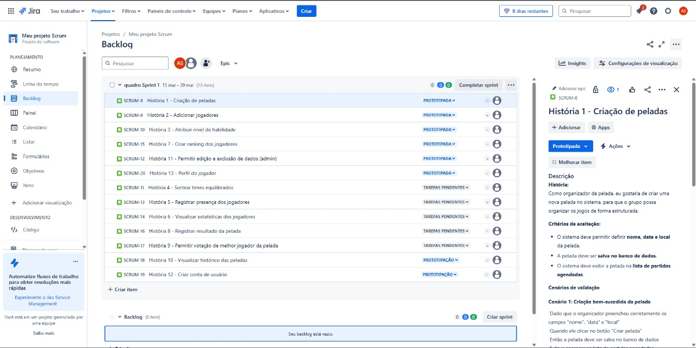
  - 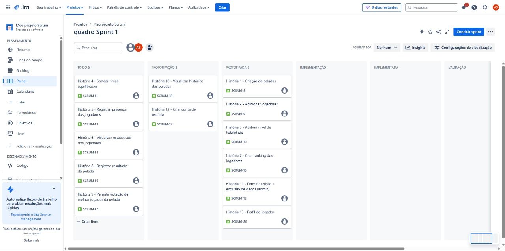
  -  
- **Protótipo no Figma:**
  https://www.figma.com/proto/nnLLzpM4WSxZz1bswSUSUQ/FutHub?node-id=1-2650&p=f&t=9IbFr02wzVe4Yd8x-0&scaling=min-zoom&content-scaling=fixed&page-id=0%3A1
- **Screencast (1ª entrega):**
  [YouTube](https://youtu.be/ffIBYHROJXc)

---

### 📌 Segunda Entrega

- **Prints do Jira:**
  - 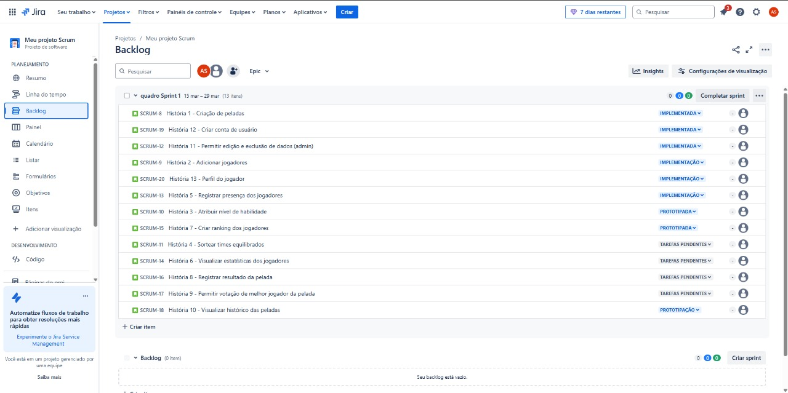
  - 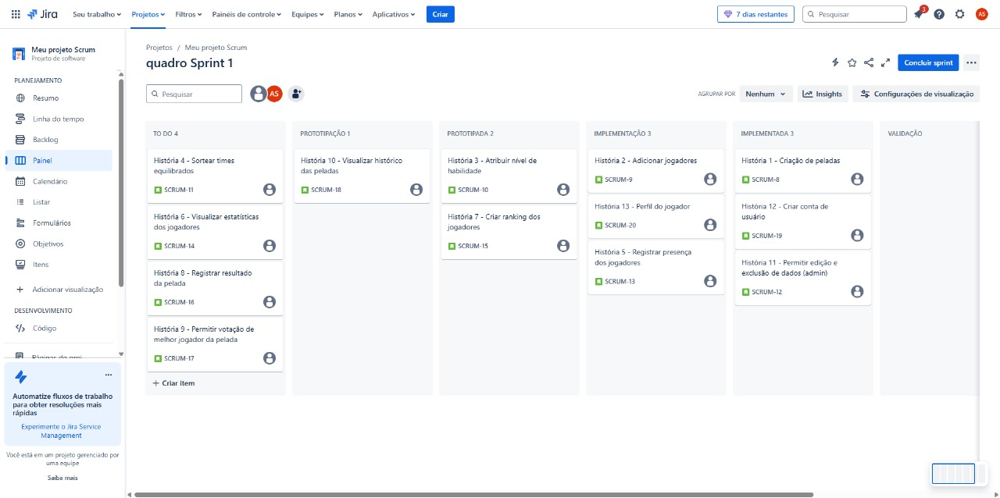
- **Bugtracker:**
  - 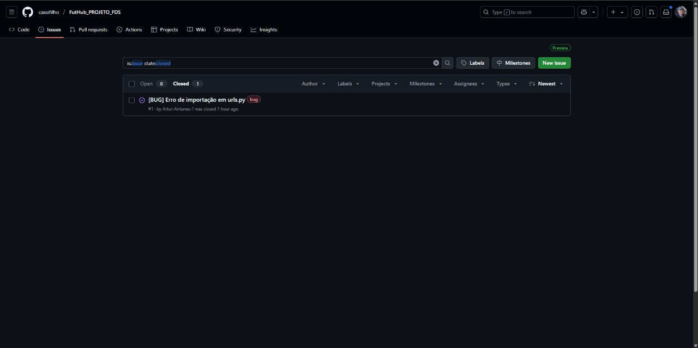
- **Screencast (2ª entrega):**
  [YouTube](https://youtu.be/nuT67NEw2OI)
- **Link do Deploy:**
  [FutHub](https://futhub-webapp.azurewebsites.net/)

---

### 📌 Terceira Entrega

- **Prints do Jira:**
  - 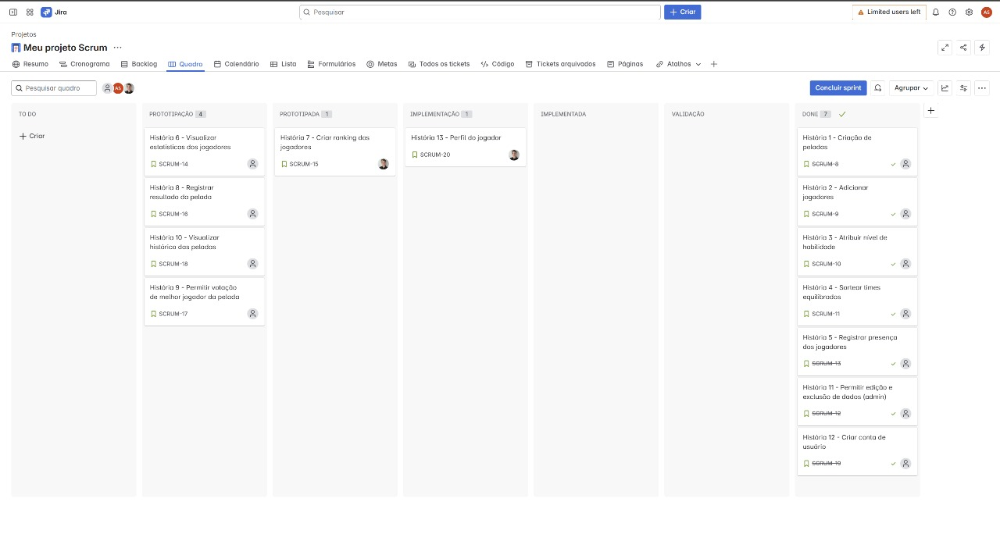
  - 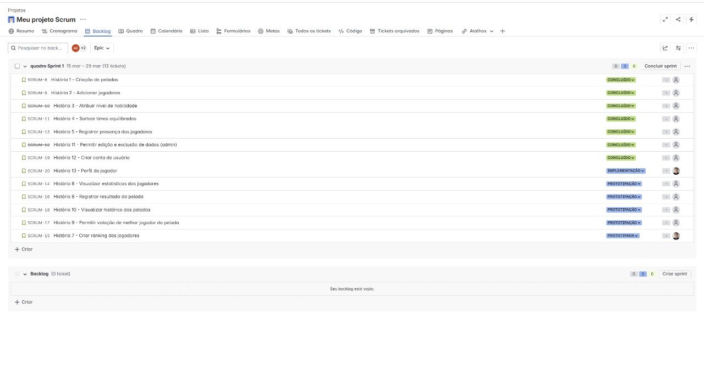
- **Sketches e Storyboards:**
  - 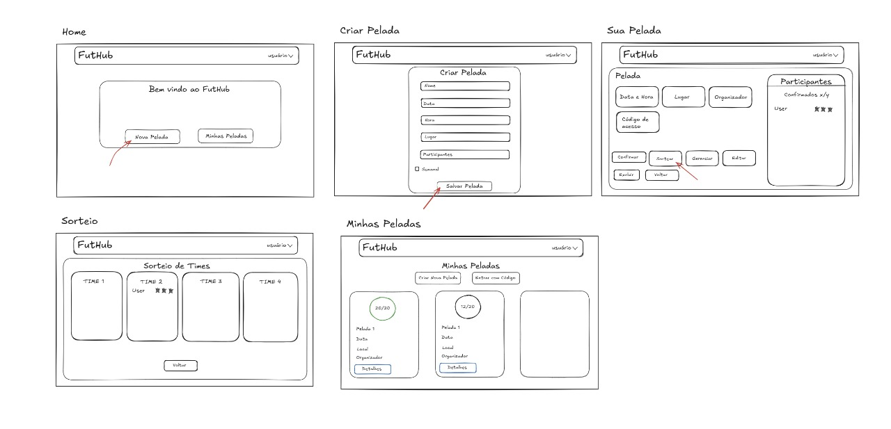
  [Link Sketches](https://excalidraw.com/#json=inS96UiVY6opdNU_MN4M6,VcEWgoPLnX4CsZyGPpmfkg)
- **Protótipo (Lo-fi) no Figma:**
  https://www.figma.com/design/4B4M0lC5O2rvr2410vKzRj/Untitled?node-id=0-1&p=f&t=Sjmnr7B0S8HAzbvp-0
- **Bugtracker:**
  - 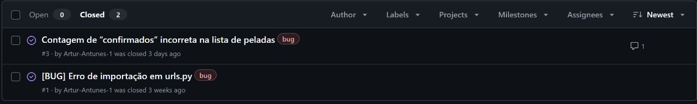
  - 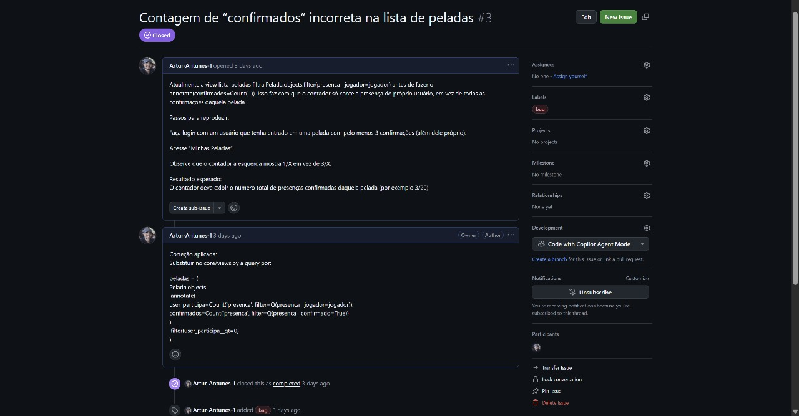
- **Relatório programação em par:**
  https://docs.google.com/document/d/1TQgb-lOd8iuQMU3bbPHmrO_rELMWlH9_RSnwnXBMTo8/edit?tab=t.0
- **Screencasts:**
  - [Playlist screencasts Entrega 3](https://youtube.com/playlist?list=PLgbzrH77ofEq27PFBITjqo005BxgAkPs3&si=d-Br92G12rhJDR7y)
  - [Protótipo Lo-fi](https://youtu.be/TByB4HvQIe0)
  - [Build & Deployment automatizados](https://youtu.be/e0QMKyoSIPQ)
  - [Testes E2E](https://youtu.be/ooi2wBZZ6Hg)
  - [Deployment funcional](https://youtu.be/095i6zr3qnE)
  - [Testes E2E atualizados](https://youtu.be/V86Tbh_IFhg)
  - [Build com novos testes](https://youtu.be/safdD0Ketbk)

---

### 📌 Quarta Entrega

- **Prints do Jira:**
  - 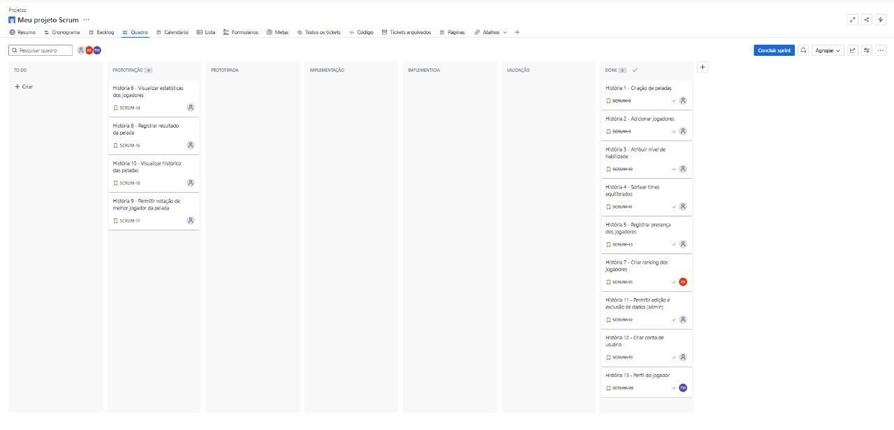
  - 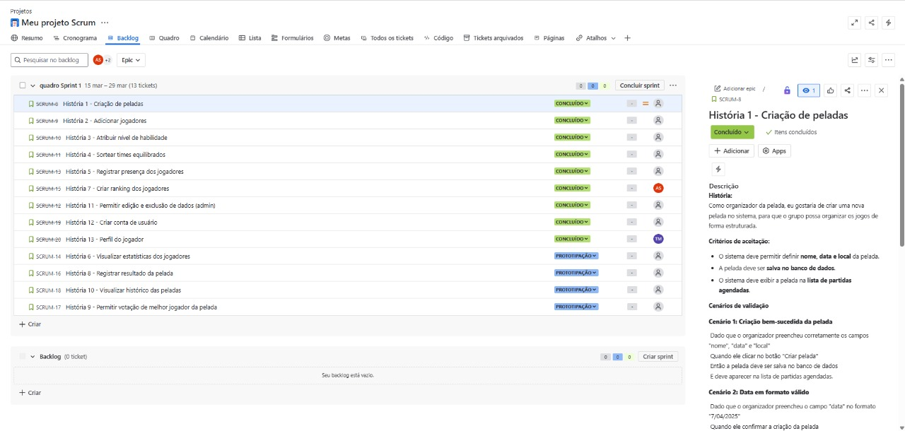
- **Sketches e Storyboards:**
  - 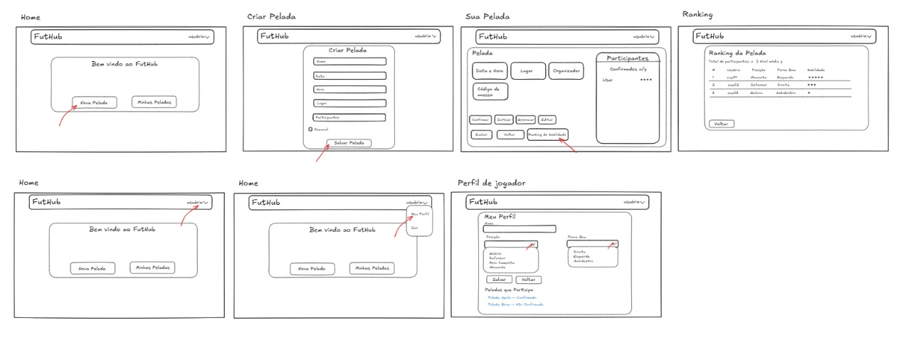
  [Link Sketches](https://excalidraw.com/#json=Z0KBlag9LiqjUG9DmY48M,Zax7w7vaF_E1o0gTqnsdQA)
- **Protótipo (Lo-fi) no Figma:**
  [FIGMA](https://www.figma.com/design/fBaIoMmmnCeaU54Mpx88bv/Untitled--Copy-?node-id=0-1&t=akuzXdzjN2MxvbrL-1)
- **Bugtracker:**
  - 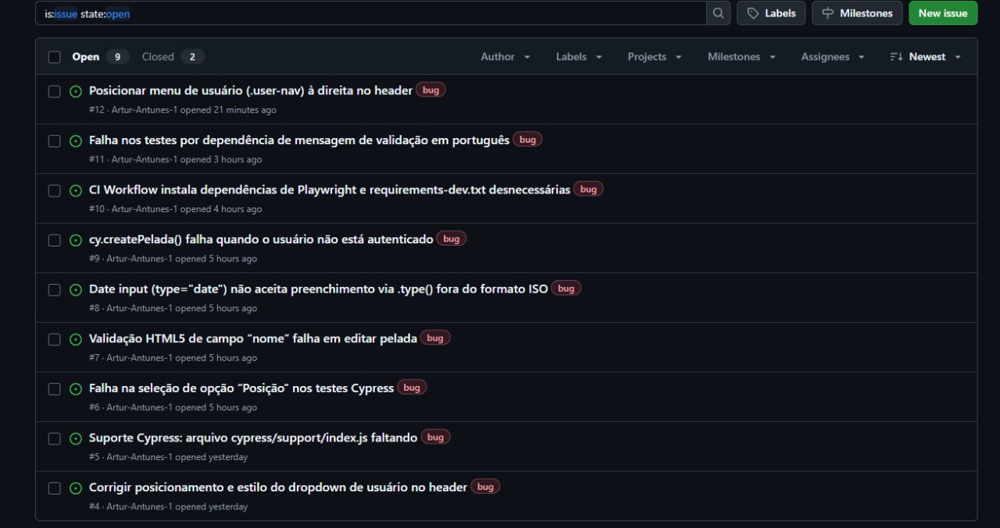
  - 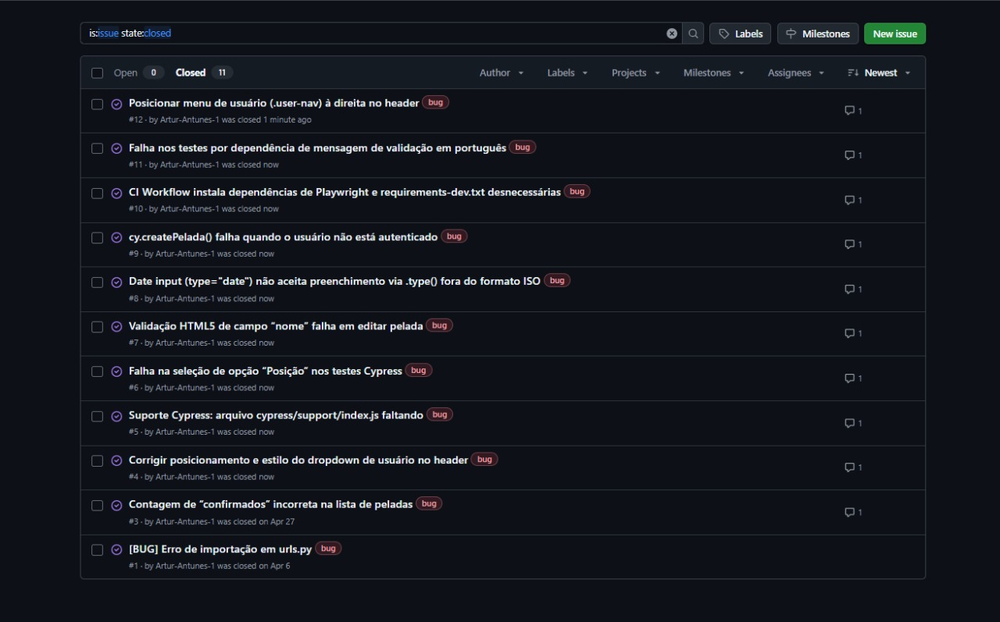
- **Relatório programação em par:**
  https://docs.google.com/document/d/1u6TygPyi8bbPZCNfdbjMIy3CUTdUkXnHvStJTQ-PzJU/edit?usp=sharing
- **Screencasts:**
  - [Playlist screencasts Entrega 4](https://youtube.com/playlist?list=PLgbzrH77ofEpPXSfeyPoiNzNlkuvt2Lmx&si=FdeeXQHOnI6CxkyV)
  - [Protótipo Lo-fi](https://youtu.be/-reyFF0_O7A?si=x9t9sQSrLtmMJqBN)
  - [Build & Deployment automatizados](https://youtu.be/Ce-T60s-a9c?si=7U0r6IRpZSdJ-C2l)
  - [Testes E2E](https://youtu.be/i6GlbLmANGE?si=l9tQhpxQNVP9JVl9)
  - [Deployment funcional](https://youtu.be/pnMf2Ouriek?si=g4yTP8AY3fFifhyI)