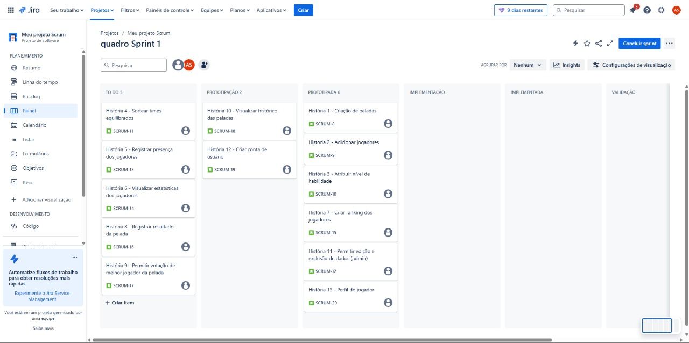
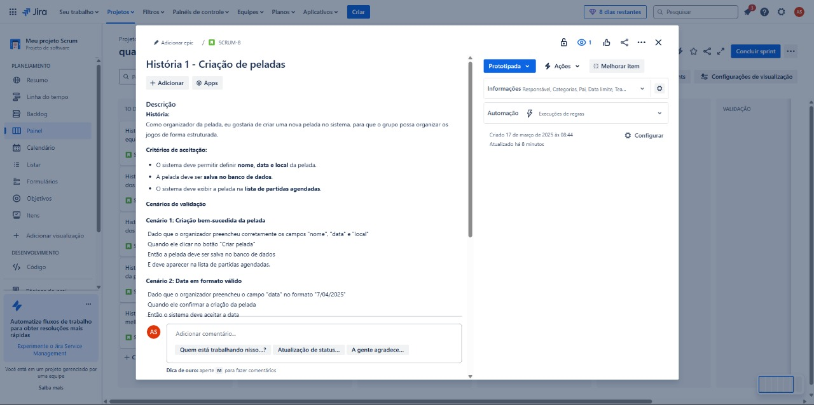
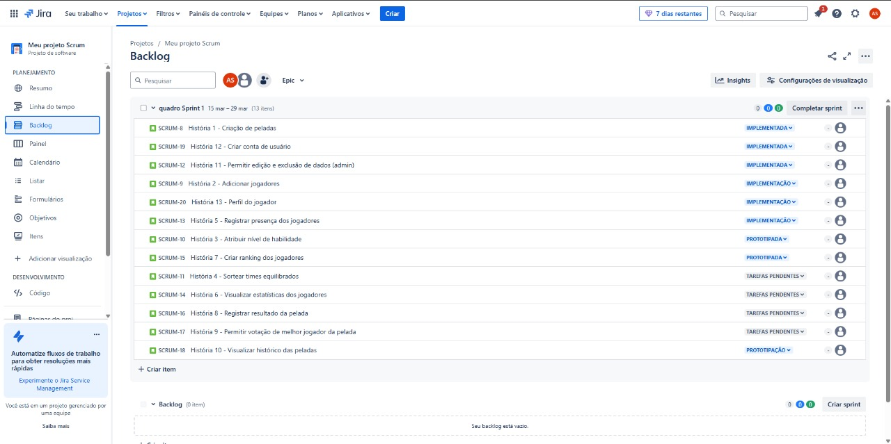
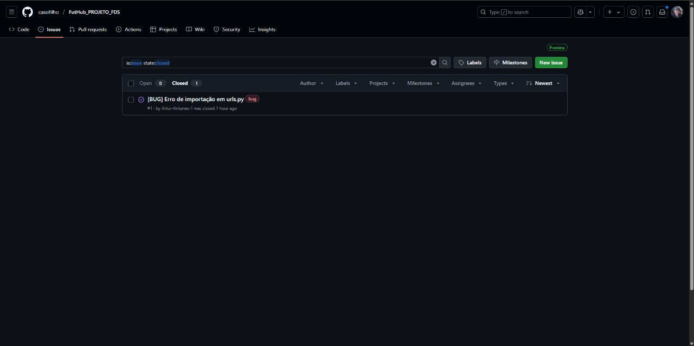

# ⚽ FutHub (Aplicação de gerenciamento de peladas)

## 📌 Sobre o Projeto

Este projeto faz parte da disciplina de **Fundamentos de Desenvolvimento de Software** e tem como objetivo criar uma aplicação para facilitar o gerenciamento de peladas de futebol amador.

## 👥 Integrantes do Grupo

- **Artur Antunes**
- **Cassiano Moraes**
- **Davi Dimitri**
- **Marco Veras**
- **Thiago Alves**

## 🎯 Objetivo

A aplicação permitirá que jogadores:

- 📅 Organizem partidas de futebol ;
- ✅ Façam inscrições e confirmem presença nos jogos;
- 🏆 Formem times automaticamente ou manualmente;
- 📊 Acompanhem estatísticas e histórico de partidas.

## Primeira Entrega

**Link para docs com as histórias**
{https://docs.google.com/document/d/1h6qE8jEHx7tMy1SQPBCbcUVZUt3K8P8A9gGN2vL5aVc/edit?usp=sharing} 

**Link para o jira**
{https://projeto-fds-gp3.atlassian.net/jira/software/projects/SCRUM/boards/1} 

**Prints do jira**

**Link para protótipo do figma**
{https://www.figma.com/proto/nnLLzpM4WSxZz1bswSUSUQ/FutHub?node-id=1-2650&p=f&t=9IbFr02wzVe4Yd8x-0&scaling=min-zoom&content-scaling=fixed&page-id=0%3A1}

**Link para screencast no youtube**
{[FutHub_PROJETO_FDS](https://youtu.be/ffIBYHROJXc)}

## Segunda Entrega

**Prints do jira**

**Link para screencast no youtube**
{[FutHub_PROJETO_FDS_Entrega2](https://youtu.be/nuT67NEw2OI)}